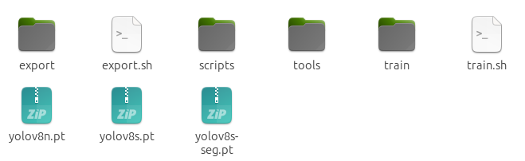
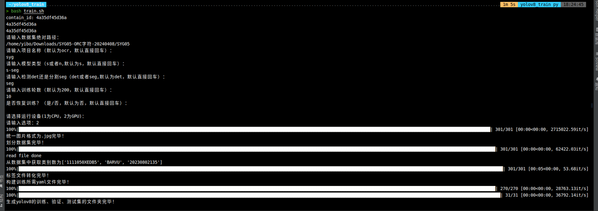
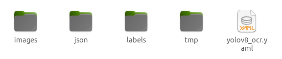
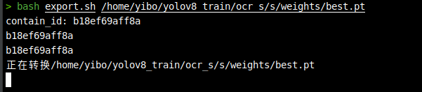

# 基于官方yolov8的训练+导出
## 一、训练目录阐释

1. *export*目录的作用是为训练好的模型进行模型转换，以便可以部署
2. *export.sh*是训练后一键转换模型的bash脚本
3. *tools*目录的作用是为训练前的数据集进行预处理，以便可以训练
4. *train*目录的作用是进行模型训练
5. *train.sh*是一键执行训练的*bash*脚本
6. *pt*后缀的都是训练需要的预训练模型，是官方训练效果很好的模型
7. *dataset*是运行*train.sh*根据用户给的数据集构建的可训练的目录，**与用户指定的路径互不影响**

## 二、数据预处理+训练模型
1. 一键训练官方yolov8的目标检测或者实例分割模型
2. 只需运行bash脚本，根据提示输入即可训练：
`bash train.sh
`
3. 运行环境： 
```
docker pull registry.cn-shanghai.aliyuncs.com/epo0408/yolov8_ocr:v1.1
```
4. 输入只需要图片带json的数据集路径，会一键构建训练集验证集，包含转换txt标注格式


5. 数据预处理后，路径下的原始数据集结构不变，会在训练根目录的dataset里生成如下可用于训练的目录结构：


* images是划分好的图片目录
* json是所有图片的json标注文件
* labels是用于训练的由json转换而来并且划分好的txt文件
* tmp里存放那个是所有图片的地址
* yaml文件是自动生成的含有训练集、验证集以及类别信息的训练配置文件

## 三、导出模型（转换模型）
1. 训练完毕的best.pt文件会在上面说的存放训练文件的目录下找到。

2. 只需要执行：`bash export.sh 模型pt文件的绝对路径 `即可转换模型，转好的模型和类别码与best.pt同级



